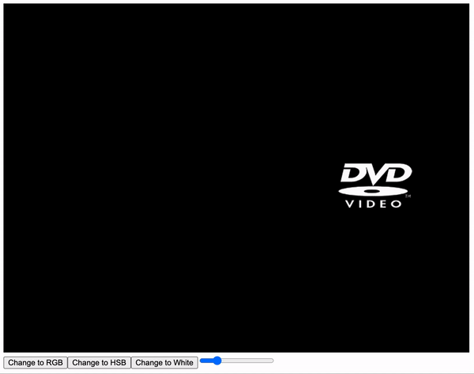

# bouncing-dvd-logo
Adjust the speed and color of the logo as it travels on it's journey across the screen. 
When changed from the default white logo, the color changes to a random RGB or HSB value every time it collides with the edge of the screen and changes direction.

### Demo of logo bouncing around screen

### Demo of RSB/HSB/default color changes and speed adjustments

